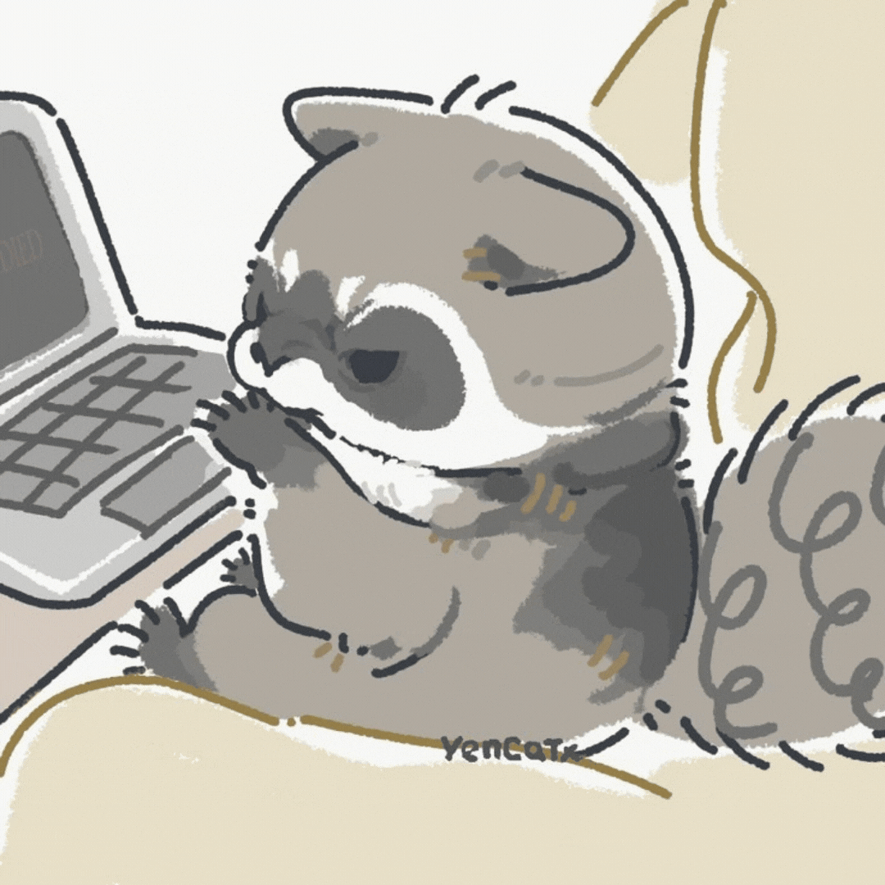

  

#

  

#

  <b>Software Developer | Backend | Web Applications</b>

  Computer Science student at <b>UNIESP</b>, focused on backend development, APIs, automation and scalable systems. 
  I build projects using <b>Java, JavaScript, Python and SQL</b>, always improving my skills to create efficient and useful solutions.

#

<h3 align="left">Connect with me!</h3>

  

<h3 align="left">My Stack ~</h3>

  
  
  
  
  
  
  
  
  
  
  
  
  
  
  
  
  

#

<h3 align="left">My Technologies ~</h3>

  

#

<h3 align="left">Featured Projects ~</h3>

- [**TechJur**](https://github.com/Selhorstkaliel/pjt-TechJur)  
  Legal tech project focused on process organization and intelligent legal data analysis.

- [**Personal Trainer Backend**](https://github.com/Selhorstkaliel/Personal-Trainer-Backend)  
  Backend application for workout and user management.

- [**Back_end-Financeiro**](https://github.com/Selhorstkaliel/Back_end-Financeiro)  
  Financial backend project focused on business rules and data organization.

- [**Leitor de PDF**](https://github.com/Selhorstkaliel/leitor_de_pdf)  
  Application for reading documents and extracting structured information automatically.

- [**Discord Bot**](https://github.com/Selhorstkaliel/Discord_bot)  
  Automation bot for Discord servers.

- [**GameHub**](https://github.com/Selhorstkaliel/gamehub)  
  Web project focused on interface, interaction and gaming environment structure.

#

<h3 align="left">My Development Operating System ~</h3>

  
  
  
  
  
  
  

#

<h2 align="left">🌐 Languages I Speak:</h2>

  🇧🇷 Portuguese (Native) 
  🇺🇸 English (B1) 
  🇮🇹 Italian (B2) 
  🇷🇺 Russian (B2) 
  🇩🇪 German (Beginner)

#

  <h3>* GitHub Stats *</h3>
   
  
.
  

#

<picture align="center">
  <source media="(prefers-color-scheme: dark)" srcset="https://raw.githubusercontent.com/Selhorstkaliel/Selhorstkaliel/output/github-contribution-grid-snake-dark.svg">
  <source media="(prefers-color-scheme: light)" srcset="https://raw.githubusercontent.com/Selhorstkaliel/Selhorstkaliel/output/github-contribution-grid-snake-dark.svg">
  
</picture>
