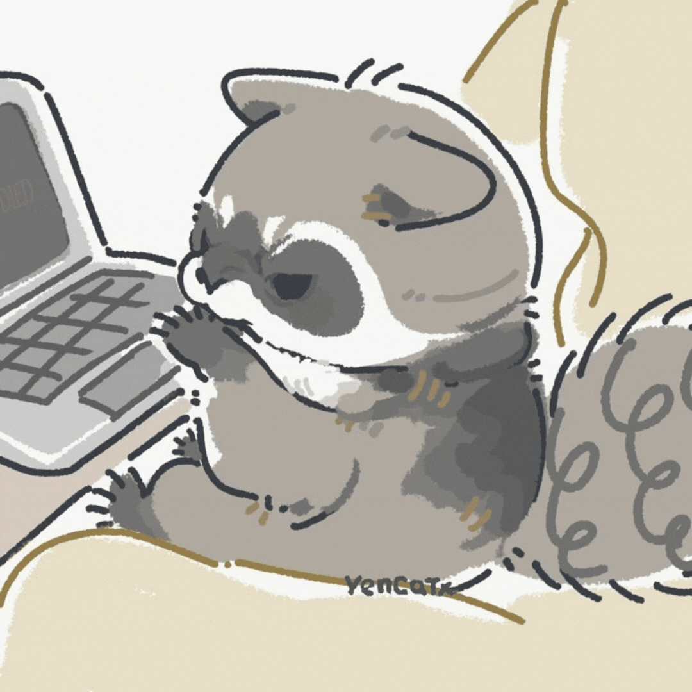

  

#

#

 Computer Science student at the Union of Educational Institutions of the State of São Paulo (UNIESP).
Currently, I work with Python, Ruby, HTML, CSS, JavaScript, C, SQL, and Dart and am constantly improving my skills to develop innovative and efficient solutions.
I am looking for new opportunities and am ready to contribute to challenging projects!

#

<h3 align="left">Connect with me!</h3>

<h3 align="left">My Stack ~</h3>

  
  
  
  
  
  
  
  
  
  
  
  
  
  
  
  
  
  

#

<h3 align="left">My Technologies ~</h3>

  
  
  
  
  
  
  
  
  
  
  

#

<h3 align="left">My Development Operating System ~</h3>

 
  
  
  
  

#

<h2 align="left">🌐Languages I Speak:</h2>

🇧🇷 Portuguese (native) 🇺🇸 English (B1)  🇮🇹 Italian (B2)  🇩🇪 German (beginner)  🇷🇺 Russian (beginner)

#

  <h3>* GitHub Stats *</h3>
   
  

  

#

<picture align="center">
  <source media="(prefers-color-scheme: dark)" srcset="https://raw.githubusercontent.com/Selhorstkaliel/Selhorstkaliel/output/github-contribution-grid-snake-dark.svg">
  <source media="(prefers-color-scheme: light)" srcset="https://raw.githubusercontent.com/Selhorstkaliel/Selhorstkaliel/output/github-contribution-grid-snake-dark.svg">
  
</picture>
